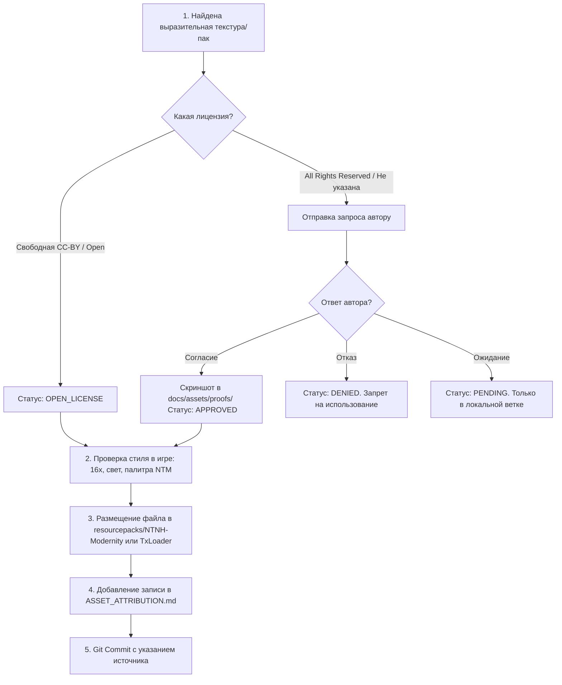

# Стандарт: Реестр ассетов, авторских прав и визуальной стилистики (Asset Attribution & Registry)

> **Тип документа:** Регламент и реестр ассетов (`Asset Governance & Attribution Registry`)  
> **Статус:** 🟢 Действующий стандарт NTNH  
> **Область применения:** Ресурспаки (`NTNH-Modernity`), TxLoader (`config/txloader/`), кастомные оверлеи и ассеты модов  

---

## 1. Миссия и визуальное видение NTNH

* **Цель визуальной модернизации:**
  Minecraft 1.7.10 страдает от визуальной архаичности (простые плоские текстуры времен 2013-2014 годов, серые монотонные GUI, несбалансированные контрасты). Задача NTNH — придать сборке **собственную современную визуальную идентичность**:
  1. Современный пиксель-арт (JAPPA-стиль, глубокие тени, тёплые/холодные объёмные полутона, выразительный рельеф).
  2. Разрешение strictly **16x16** (сохранение высокой производительности и нативной пиксельной сетки Minecraft).
  3. Гармония с брутальным индастриал-стилем **HBM's Nuclear Tech Mod** (блоки и руды не должны выглядеть игрушечными или чужеродными на фоне реакторов и турбин).
* **Принцип авторского уважения (Ethical Curation):**
  Мы не крадем контент втихую. Каждая текстура, взятая у стороннего художника или из стороннего пака, имеет чёткую историю происхождения, статус разрешения и атрибуцию в титрах сборки.

---

## 2. Статусы разрешений и хранение доказательств

Каждый внешний ресурспак или отдельная текстура обязаны иметь один из следующих статусов:

| Статус | Обозначение | Описание | Действие |
| :--- | :---: | :--- | :--- |
| **APPROVED** | 🟢 | Получено прямое разрешение от автора (в Discord, PM, тикете и т.д.). | Пруф (скриншот переписки) сохраняется в `docs/assets/proofs/`. |
| **OPEN_LICENSE** | 🔵 | Ресурс распространяется под свободной лицензией (CC-BY, CC-BY-SA, MIT, Public Domain). | Требуется только сохранение ссылки и имени автора в титрах. |
| **PENDING** | 🟡 | Запрос автору отправлен, ответ ожидается. | Разрешено тестировать только в локальных dev-ветках; релиз в прод запрещен. |
| **DENIED** | 🔴 | Автор отказал в использовании или прямо запретил включение в модпаки. | Текстуры немедленно удаляются из репозитория. Использование строго запрещено. |

> [!IMPORTANT]
> **Папка для доказательств:** Скриншоты переписок с подтверждением согласия авторов сохраняются по пути `docs/assets/proofs/<pack_or_author_name>.png`.

---

## 3. Реестр авторов и паков-доноров (Master Registry)

В эту таблицу вносятся все базовые паки и независимые авторы, чьи работы отобраны для NTNH:

| ID донора | Название ресурспака | Автор | Ссылка на оригинальный проект | Лицензия / Статус | Пруф разрешения |
| :--- | :--- | :--- | :--- | :---: | :--- |
| `MODERNITY` | **Modernity 1.7.10** | AstroTibs | [CurseForge Project](https://www.curseforge.com/minecraft/texture-packs/modernity) | 🔵 CC-BY-NC 4.0 | Указан в титрах пака |
| `MOD_ADJUNCT`| **Modernity Adjunct** | AstroTibs | [CurseForge Project](https://www.curseforge.com/minecraft/texture-packs/modernity-adjunct) | 🔵 CC-BY-NC 4.0 | Указан в титрах пака |
| `MOD_EXTRA` | **Modernity Extra (Unofficial)** | margatroidu | [CurseForge Project](https://www.curseforge.com/minecraft/texture-packs/unofficial-modernity-extra/) | 🔵 Open / Mentioned | Указан в титрах пака |
| `NTM_VANIL` | **NTM Vanilled** | TheVitya2127 | [Modrinth Project](https://modrinth.com/resourcepack/ntm-vanilled) | 🔵 Open / Mentioned | Указан в титрах пака |
| `BIBLIO_LEGACY` | **Bibliocraft-Legacy** | MinecraftschurliMods | [GitHub Repository](https://github.com/MinecraftschurliMods/Bibliocraft-Legacy) | 🔵 OPEN_LICENSE (MIT) | [MIT License](https://github.com/MinecraftschurliMods/Bibliocraft-Legacy/blob/main/LICENSE) |

*(При добавлении новых авторов вносите новую строку с уникальным `ID донора`).*

---

## 4. Пофайловый реестр заимствованных ассетов (Asset Ledger)

> **Правило:** При добавлении одиночных текстур или групп файлов из разных паков сюда вносится точный путь, чтобы спустя любое время было понятно происхождение файла.

### 4.1. Интерфейсы и контейнеры (GUI)

| Путь в NTNH (`config/txloader/...` или `assets/...`) | ID донора | Оригинальный файл/пак | Описание / Изменения NTNH | Статус |
| :--- | :--- | :--- | :--- | :---: |
| `config/txloader/forceload/bibliocraft/textures/gui/bigbookGUI.png` | `BIBLIO_LEGACY` | `textures/gui/big_book.png` | Интерфейс большой книги (256x256) | 🔵 OPEN_LICENSE |
| `config/txloader/forceload/bibliocraft/textures/gui/bookshelfGUI.png` | `BIBLIO_LEGACY` | `textures/gui/bookcase.png` | Интерфейс книжного шкафа (256x256) | 🔵 OPEN_LICENSE |
| `config/txloader/forceload/bibliocraft/textures/gui/clipboardGUI.png` | `BIBLIO_LEGACY` | `textures/gui/clipboard.png` | Интерфейс планшета для заметок | 🔵 OPEN_LICENSE |
| `config/txloader/forceload/bibliocraft/textures/gui/clockGUI.png` | `BIBLIO_LEGACY` | `textures/gui/clock.png` | Интерфейс настенных часов | 🔵 OPEN_LICENSE |
| `config/txloader/forceload/bibliocraft/textures/gui/cookiejarGUI.png` | `BIBLIO_LEGACY` | `textures/gui/cookie_jar.png` | Интерфейс банки для печенья | 🔵 OPEN_LICENSE |
| `config/txloader/forceload/bibliocraft/textures/gui/discrackGUI.png` | `BIBLIO_LEGACY` | `textures/gui/disc_rack.png` | Интерфейс стойки для пластинок | 🔵 OPEN_LICENSE |
| `config/txloader/forceload/bibliocraft/textures/gui/armorstandGUI.png` | `BIBLIO_LEGACY` | `textures/gui/fancy_armor_stand.png` | Интерфейс стойки для брони | 🔵 OPEN_LICENSE |
| `config/txloader/forceload/bibliocraft/textures/gui/fancyworkbenchGUI.png` | `BIBLIO_LEGACY` | `textures/gui/fancy_crafter.png` | Интерфейс верстака декоратора | 🔵 OPEN_LICENSE |
| `config/txloader/forceload/bibliocraft/textures/gui/fancysignGUI.png` | `BIBLIO_LEGACY` | `textures/gui/fancy_sign.png` | Интерфейс таблички | 🔵 OPEN_LICENSE |
| `config/txloader/forceload/bibliocraft/textures/gui/woodlabelGUI.png` | `BIBLIO_LEGACY` | `textures/gui/label.png` | Интерфейс деревянной бирки | 🔵 OPEN_LICENSE |
| `config/txloader/forceload/bibliocraft/textures/gui/potionshelfGUI.png` | `BIBLIO_LEGACY` | `textures/gui/potion_shelf.png` | Интерфейс полки зелий | 🔵 OPEN_LICENSE |
| `config/txloader/forceload/bibliocraft/textures/gui/genericshelfGUI.png` | `BIBLIO_LEGACY` | `textures/gui/shelf.png` | Интерфейс обычной настенной полки | 🔵 OPEN_LICENSE |
| `config/txloader/forceload/bibliocraft/textures/gui/slottedbookGUI.png` | `BIBLIO_LEGACY` | `textures/gui/slotted_book.png` | Интерфейс книги-тайника | 🔵 OPEN_LICENSE |
| `config/txloader/forceload/bibliocraft/textures/gui/stockcatalogGUI.png` | `BIBLIO_LEGACY` | `textures/gui/stockroom_catalog.png` | Интерфейс каталога склада | 🔵 OPEN_LICENSE |

### 4.2. Руды и материалы (Ores & Materials)

| Путь в NTNH (`assets/...`) | ID донора | Оригинальный файл/пак | Описание / Изменения NTNH | Статус |
| :--- | :--- | :--- | :--- | :---: |
| *(пример)* `hbm:textures/blocks/ore_uranium.png` | `NTM_VANIL` | `assets/hbm/.../ore_uranium.png` | JAPPA-стиль с глубокой тенью вкраплений | 🔵 OPEN_LICENSE |

### 4.3. Блоки и декорации (World & Blocks)

| Путь в NTNH (`assets/...`) | ID донора | Оригинальный файл/пак | Описание / Изменения NTNH | Статус |
| :--- | :--- | :--- | :--- | :---: |
| *(пример)* `minecraft/textures/blocks/cobblestone.png` | `MODERNITY` | `assets/minecraft/textures/blocks/cobblestone.png` | Современный булыжник | 🔵 OPEN_LICENSE |

### 4.4. Предметы и экипировка (Items)

| Путь в NTNH (`config/txloader/...` или `assets/...`) | ID донора | Оригинальный файл/пак | Описание / Изменения NTNH | Статус |
| :--- | :--- | :--- | :--- | :---: |
| `config/txloader/forceload/bibliocraft/textures/items/bigbook.png` | `BIBLIO_LEGACY` | `textures/item/big_book.png` | Большая книга (16x16) | 🔵 OPEN_LICENSE |
| `config/txloader/forceload/bibliocraft/textures/items/clipboard.png` | `BIBLIO_LEGACY` | `textures/item/clipboard.png` | Планшет для записей (16x16) | 🔵 OPEN_LICENSE |
| `config/txloader/forceload/bibliocraft/textures/items/lock.png` | `BIBLIO_LEGACY` | `textures/item/lock_and_key.png` | Замок с ключом (16x16) | 🔵 OPEN_LICENSE |
| `config/txloader/forceload/bibliocraft/textures/items/plumbline.png` | `BIBLIO_LEGACY` | `textures/item/plumb_line.png` | Строительный отвес (16x16) | 🔵 OPEN_LICENSE |
| `config/txloader/forceload/bibliocraft/textures/items/stockcatalog.png` | `BIBLIO_LEGACY` | `textures/item/stockroom_catalog.png` | Каталог склада (16x16) | 🔵 OPEN_LICENSE |
| `config/txloader/forceload/bibliocraft/textures/items/tapemeasure.png` | `BIBLIO_LEGACY` | `textures/item/tape_measure.png` | Рулетка (16x16) | 🔵 OPEN_LICENSE |
| `config/txloader/forceload/bibliocraft/textures/items/tape.png` | `BIBLIO_LEGACY` | `textures/item/tape_reel.png` | Катушка мерной ленты (16x16) | 🔵 OPEN_LICENSE |

---

## 5. Шаблоны писем для запроса разрешений

### 5.1. Английский шаблон (CurseForge, Modrinth, Discord, PlanetMinecraft)

```text
Subject: Permission request for textures in NTNH modpack (Minecraft 1.7.10)

Hi [Author Name]!

I am one of the developers of Nuclear Tech: New Horizons (NTNH), a high-tech automation and engineering modpack for Minecraft 1.7.10 (built around HBM's Nuclear Tech Mod).

We really love your visual style and shading in "[Resource Pack Name]", especially [specific textures: e.g. the dark GUIs / ores / foliage / stone variants]. 

We are working on modernizing the 1.7.10 visuals and would love to include some of your textures in our curated aesthetic pack.

Would you be comfortable granting us permission to include them?
- We will clearly credit you and provide a direct link to your original project in our repository, CREDITS file, and in-game documentation.
- The modpack is strictly free and non-commercial.

Thank you very much for your time and for creating such great art!

Best regards,
[Your Name / Nickname] (NTNH Team)
```

### 5.2. Русский шаблон (СНГ-комьюнити)

```text
Тема: Запрос разрешения на использование текстур в модпаке NTNH (Minecraft 1.7.10)

Привет, [Имя/Ник автора]!

Мы разрабатываем индустриально-технологический модпак Nuclear Tech: New Horizons (NTNH) на версии 1.7.10. Нам очень понравились твои работы в ресурспаке «[Название пака]», особенно [что конкретно: интерфейсы / руды / стиль блоков] — отличная проработка теней и гармоничная палитра.

Хотели спросить твоего согласия на включение части этих текстур в наш визуальный пак сборки.
- Мы обязательно укажем твоё авторство и разместим прямую ссылку на оригинальный проект в описании сборки, на GitHub и во внутриигровой книге квестов.
- Сборка полностью некоммерческая и бесплатная.

Будем искренне признательны за ответ!
С уважением,
[Твой ник] (команда NTNH)
```

---

## 6. Пошаговый пайплайн добавления (Workflow Checklist)

Перед включением любой новой текстуры в сборку автор изменений обязан пройти чеклист:



1. **Проверка стиля в игре:** Сравнить текстуру рядом с блоками NTM и ванили. Свет должен падать стандартно (сверху-слева), палитра не должна "резать глаз" кислотными цветами.
2. **Фиксация пруфа:** При получении согласия скриншот помещается в `docs/assets/proofs/<author>_<pack>.png`.
3. **Запись в реестр:** Добавить строки в Таблицу 3 (Мастер-реестр) и Таблицу 4 (Пофайловый учет) настоящего документа.
4. **Коммит:** Оформить коммит с понятным сообщением (например, `feat(assets): add modern stone textures from [PackName] by [Author]`).
